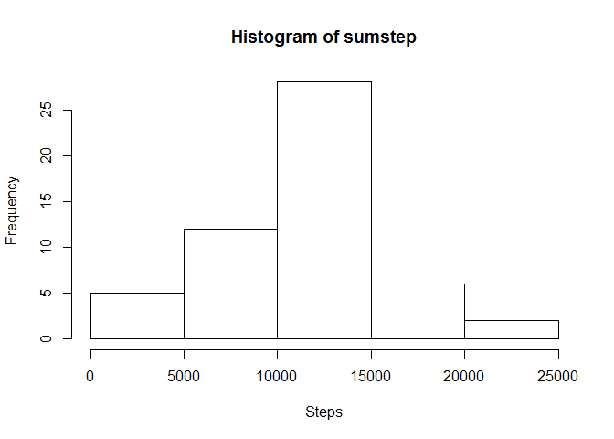
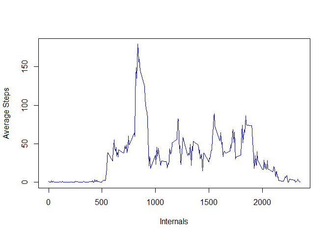
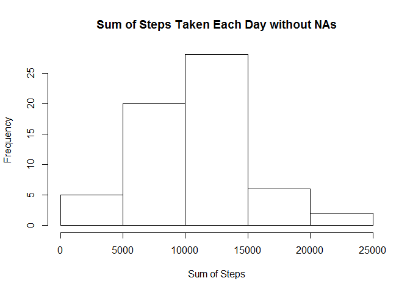
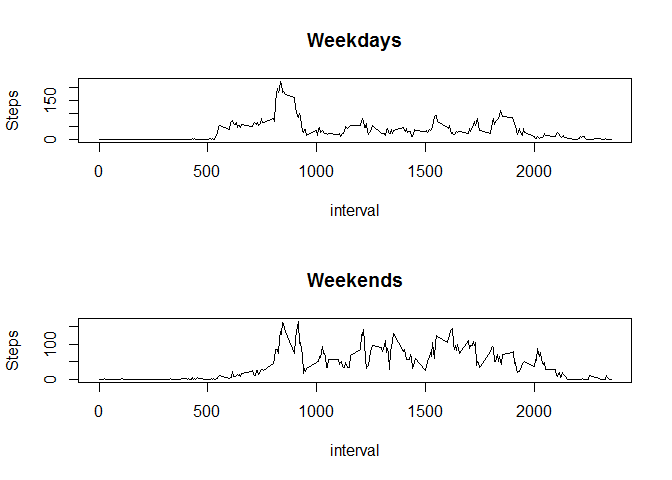

## Introduction

It is now possible to collect a large amount of data about personal movement using activity monitoring devices such as a Fitbit, Nike Fuelband, or Jawbone Up. These type of devices are part of the "quantified self" movement - a group of enthusiasts who take measurements about themselves regularly to improve their health, to find patterns in their behavior, or because they are tech geeks. But these data remain under-utilized both because the raw data are hard to obtain and there is a lack of statistical methods and software for processing and interpreting the data.

This assignment makes use of data from a personal activity monitoring device. This device collects data at 5 minute intervals through out the day. The data consists of two months of data from an anonymous individual collected during the months of October and November, 2012 and include the number of steps taken in 5 minute intervals each day.

## Reading the file into R


```r
setwd("c:/Users/yii/Desktop/R code/")
unzip("activity.zip")
act<-read.csv("activity.csv")
```

##1. What is the total number of steps taken per day?
### Calculating total number of steps taken each day and making a hitogram

```r
sumstep<-with(act,tapply(steps,date,FUN=sum))
hist(sumstep,xlab="Steps")
```

<!-- -->

### Mean and median of steps per day

```r
mea<-round(sum(sumstep,na.rm=TRUE)/length(unique(act$date)))
med<-round(median(sumstep,na.rm=TRUE))
```
The mean of the total number of steps taken per day is 9354.  
The median of the total number of steps taken per day is 1.0765\times 10^{4}.

##2. What is the average daily activity pattern?
### Make a time series plot of the 5-minute interval (x-axis) and the average number of steps taken, averaged across all days (y-axis)

```r
int<-aggregate(steps~interval,act,sum)
int$avg<-int[,2]/length(unique(act$date))
with(int,plot(interval,avg,type="l",xlab="Internals",ylab="Average Steps",col="blue"))
```

<!-- -->

```r
max<-int[which.max(int$avg),]
a<-max[,1]
b<-round(max[,3])
```
The interval 835, on average across all the days in the data set, contains the maximum number of steps, which is 179 steps.

##3. Imputing missing values
###Calculate and report the total number of missing values.

```r
sumNA<-sum(is.na(act))
```
The total number of NAs is 2304.

###Filling in all of the missing values with the mean of 5-minute interval, creating new dataset, and making a histogram of the total number of steps taken each day.

```r
act1<-act
act1[is.na(act1)]<-int$avg
sumstep1<-tapply(act1$steps,format(act1$date),FUN=sum)
hist(sumstep1,main="Sum of Steps Taken Each Day without NAs", xlab="Sum of Steps")
```

<!-- -->

###Calculating the mean and median total number of steps taken per day. 

```r
mea1<-round(sum(sumstep1)/length(unique(act1$date)))
med1<-round(median(sumstep1))
dmean<-abs(mea-mea1)
dmedian<-abs(med-med1)
nas<-round(mean(is.na(act))*100,2)
```
The mean of the total number of steps taken per day is 1.0581\times 10^{4}.  
The median of the total number of steps taken per day is 1.0395\times 10^{4}.  
The difference between two means is 1227 and the difference between medians is 370. The great difference may due to the removal of NAs for the first part of assignment.  
However,the two plots have very similar shape, because the overall NAs is only 4.37%. The only noticeable difference is from 500-10000, the frequency of the first histogram is arround 12, but on the second histogram, the frequency is about 20. There could be more missing values on the days with total steps between 5000 to 10000.

##4. Are there differences in activity patterns between weekdays and weekends?
###Creating a new factor variable in the dataset with two levels - "weekday" and "weekend".Subseting and making a plot containing a time series plot "l") of the 5-minute interval (x-axis) and the average number of steps taken, averaged across all weekday days or weekend days (y-axis). 

```r
act1$week<-weekdays(as.Date(act1$date))
act1$day <- ifelse(act1$week == "Saturday" | act1$week == "Sunday", "Weekend", "Weekday")
act1$day<- as.factor(act1$day)
#subset
weekdays<-subset(act1,day=="Weekday")
weekends<-subset(act1,day=="Weekend")
weekint<-aggregate(steps~interval,weekdays,sum)
weekint$avg<-weekint[,2]/length(unique(weekdays$date))
weekendint<-aggregate(steps~interval,weekends,sum)
weekendint$avg<-weekendint[,2]/length(unique(weekends$date))
#plot 
par(mfrow=c(2,1))
with(weekint,plot(interval,avg,type="l",main="Weekdays",ylab="Steps"))
with(weekendint,plot(interval,avg,type="l", main="Weekends", ylab="Steps"))
```

<!-- -->
